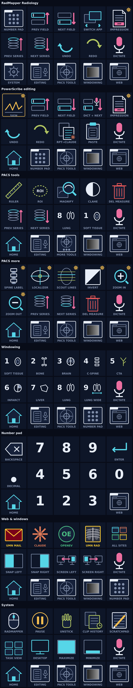

# RadMapper Radiology — Stream Deck MK.2 profile

A 15-key Stream Deck profile for the PowerScribe + IntelliSpace reading room,
built from the shortcuts RadMapper already knows about. Every button carries a
drawn icon with its name baked into the picture, so there is nothing to read
from a Stream Deck title.

## 1. Import it

1. Double-click `RadMapper Radiology.streamDeckProfile` — or open the Stream
   Deck app and go to **Preferences > Profiles > ⋯ > Import**.
2. When it asks which device the profile is for, pick your **Stream Deck MK.2**.
3. Confirm the **Home** page appears on the deck: Number pad, Prev field, Next
   field, Switch app, Impression along the top row.

## 2. Before it does anything: assign eight shortcuts

Eight buttons send a function key that nothing on the machine currently
listens for. Until you assign them in IntelliSpace and PowerScribe, those eight
keys do nothing at all.

**Test F13 in IntelliSpace and F19 in PowerScribe One first; if a recorder
refuses F13 and above, pick any unused combination it does accept and edit that
key in the Stream Deck app.**

| Button | Sends | Where to assign it |
|---|---|---|
| Spine labeling | F13 | IntelliSpace > Preferences > Keyboard shortcuts |
| Localizer mode | F14 | same |
| Scout line mode | F15 | same |
| Zoom in | F16 | same |
| Zoom out | F17 | same |
| Invert | F18 | same |
| Sign report | F19 | PowerScribe One > Settings > Quick Keys |
| Impression | F20 | PowerScribe One > Settings > Quick Keys |

**Why F13–F20.** These keys exist in the keyboard protocol but on no keyboard
you own, so nothing else sends them and they can never type a character into a
report — which is exactly what a bare letter or digit would do if the wrong
window had focus.

If your site already has a shortcut for one of these functions, edit that
button in the Stream Deck app instead (click the key, change the hotkey), or
change the key name in `build_profile.py` and rebuild.

**Symbols used below and in the pictures:**

- **⚙** — a gear badge in the corner of the icon: this button needs one of the
  eight assignments above before it does anything.
- **⛓** — a Stream Deck **Multi Action**: one press runs several steps, driven
  by the Stream Deck software itself.

## 3. The one rule

**A Stream Deck keystroke goes to whatever window is in front.** The deck has
no idea which application you meant. PowerScribe keys need PowerScribe in
front; PACS keys need the viewer in front. Three cases are worth knowing before
you press them in a live list:

| Button | Sends | With the PACS viewer in front | With PowerScribe in front |
|---|---|---|---|
| Delete measurement | Delete | deletes the selected measurement | **deletes report text** — the selection, or the character after the cursor |
| Report → Claude ⛓ | Ctrl+A, 150 ms, Ctrl+C, 150 ms, Left, open claude.ai | selects and copies whatever the viewer selects | selects the report, copies it, then Left leaves the caret at the **top of the report with nothing selected** — not in a field. Press **Next field** before you dictate again. And you still have to press **Ctrl+V** yourself once the browser is open. |
| Windowing digits / Number pad digits | 1–9, 0 | a digit **changes the window preset** | types a digit into the report |

The Windowing page and the Number pad send the same keystrokes — the top-row
digits, not the numeric keypad, so they work with NumLock off (RadMapper uses
NumLock as its pause key). With IntelliSpace in front, any digit is read as a
window preset; type numbers only into PowerScribe.

**Dictate sends F4**, PowerScribe's default dictation toggle as shipped by
RadMapper. If your PowerScribe uses another key, change the Dictate keys in the
Stream Deck app (or in `build_profile.py`).

Close window (Alt+F4) is deliberately not on the deck — one stray press would
close PowerScribe.

## 4. The layout

**Home** is the launch pad: the keys used in every case on the top two rows,
and the way into every section along the bottom.

Every other page ends in the same **strip** along the bottom row, and the
columns never move, so a section is always under the same finger:

| col 0 | col 1 | col 2 | col 3 | col 4 |
|---|---|---|---|---|
| 🏠 Home | 📁 Editing | 📁 PACS tools | 📁 Windowing | 📁 Web & windows |

On a page that is itself one of those sections, its own column would only lead
back to itself, so it holds **📁 Number pad** instead — except on PACS tools,
where that column holds **📁 PACS more**, the only way through to it. Number
pad, PACS more and System are not strip sections, so they show the plain strip;
that is why Number pad is reachable from Home, Editing, Windowing and Web &
windows, and why PACS tools is back in column 2 on PACS more.

**Dictate sits at (4,1) — the last key of the middle row — on every page except
the Number pad**, where 0 holds that slot. Wherever you are, the one key you
always need is under the same finger.

**Home** is a Switch Profile action: it switches back to the profile root, so
it returns from any depth rather than popping one folder at a time.

### Home

| | | | | |
|---|---|---|---|---|
| 📁 Number pad | Prev field (Shift+Tab) | Next field (Tab) | Switch app (Alt+Tab) | Impression ⚙ (F20) |
| Prev series (F7) | Next series (F8) | Undo (Ctrl+Z) | Redo (Ctrl+Y) | Dictate (F4) |
| 📁 System | 📁 Editing | 📁 PACS tools | 📁 Windowing | 📁 Web & windows |

### Editing (PowerScribe)

| | | | | |
|---|---|---|---|---|
| Sign ⚙ (F19) | Prev field (Shift+Tab) | Next field (Tab) | **Dictate + next field** ⛓ | Impression ⚙ (F20) |
| Undo (Ctrl+Z) | Redo (Ctrl+Y) | **Report → Claude** ⛓ | Paste (Ctrl+V) | Dictate (F4) |
| 🏠 Home | 📁 Number pad | 📁 PACS tools | 📁 Windowing | 📁 Web & windows |

Sign is the one irreversible key on the deck, so it is drawn amber inside an
amber frame and sits in the corner, a full row away from the keys you press by
the dozen. **Dictate + next field** toggles dictation, waits 150 ms, then
presses Tab.

### PACS tools

| | | | | |
|---|---|---|---|---|
| Ruler (R) | ROI (Shift+R) | Magnify (Y) | CLAHE (Shift+C) | Delete measurement (Delete) |
| Prev series (F7) | Next series (F8) | W/L 8 Lung (8) | W/L 1 Soft tissue (1) | Dictate (F4) |
| 🏠 Home | 📁 Editing | 📁 **PACS more** | 📁 Windowing | 📁 Web & windows |

### PACS more

| | | | | |
|---|---|---|---|---|
| Spine labeling ⚙ (F13) | Localizer ⚙ (F14) | Scout lines ⚙ (F15) | Invert ⚙ (F18) | Zoom in ⚙ (F16) |
| Zoom out ⚙ (F17) | Prev series (F7) | Next series (F8) | Delete measurement (Delete) | Dictate (F4) |
| 🏠 Home | 📁 Editing | 📁 PACS tools | 📁 Windowing | 📁 Web & windows |

### Windowing

| | | | | |
|---|---|---|---|---|
| 1 Soft tissue | 2 Bone | 3 Brain | 4 C-spine | 5 CTA |
| 6 Infarct | 7 Liver | 8 Lung | 9 Lung wide | Dictate (F4) |
| 🏠 Home | 📁 Editing | 📁 PACS tools | 📁 Number pad | 📁 Web & windows |

The nine RadMapper window presets, on the digits 1–9 its preset ring uses.

### Number pad

| | | | | |
|---|---|---|---|---|
| Backspace | 7 | 8 | 9 | Enter |
| decimal (.) | 4 | 5 | 6 | 0 |
| 🏠 Home | 1 | 2 | 3 | 📁 Web & windows |

The digits are a 3×3 block in the middle three columns; 0 finishes the middle
row and `.` starts it, so neither sits where a keyboard numpad puts it — this
is a Stream Deck layout, not a numpad copy. Backspace and Enter are the top
corners, Home and Web & windows the bottom corners. This is the one page
without Dictate at (4,1).

### Web & windows

| | | | | |
|---|---|---|---|---|
| UMN Mail | Claude | OpenEvidence | UMN Radiology | **Open all sites** ⛓ |
| Snap left (Win+←) | Snap right (Win+→) | To left monitor (Win+Shift+←) | To right monitor (Win+Shift+→) | Dictate (F4) |
| 🏠 Home | 📁 Editing | 📁 PACS tools | 📁 Windowing | 📁 Number pad |

### System

| | | | | |
|---|---|---|---|---|
| RadMapper settings (Ctrl+Alt+Shift+F9) | Pause/resume (Ctrl+Alt+Shift+F11) | Unstick buttons (Ctrl+Alt+Q) | Clipboard history (Ctrl+Alt+C) | Scratchpad (Ctrl+Alt+N) |
| Task view (Win+Tab) | Show desktop (Win+D) | Maximize (Win+↑) | Minimize (Win+↓) | Dictate (F4) |
| 🏠 Home | 📁 Editing | 📁 PACS tools | 📁 Windowing | 📁 Web & windows |

The five RadMapper keys are its default hotkeys from Settings. If you changed
them there, change them here (or in `build_profile.py`).

`keymap.md` lists every button on every page with the exact keystroke it sends.

## 5. If a key does nothing

- **Nothing happens at all.** Check which window is in front — the keystroke
  went there. If it is one of the ⚙ keys, it is not assigned yet (section 2).
- **A literal `` ` `` `[` or `]` appears in the report.** The profile was built
  with `ROUTE_PS_VIA_RADMAPPER = True` but RadMapper has no bindings for those
  keys. Add them on RadMapper's Keyboard page (section 7), or rebuild with the
  flag off.
- **The shortcut recorder in IntelliSpace or PowerScribe refuses F13.** Pick
  any unused combination it does accept, and edit that one key in the Stream
  Deck app.
- **A Multi Action runs only its first step.** Please report it. The step
  nesting follows a real Stream Deck export, but it has not been confirmed on a
  device.
- **The 150 ms pause seems to be missing** (the second step lands too early).
  Open the Multi Action in the Stream Deck app and add a **Delay** between the
  steps; the generated delay step is untested.
- **A digit changes the window instead of typing a number.** IntelliSpace is in
  front. Click into PowerScribe first.
- **Home does nothing, or lands on the last-open page.** Change that key's
  action to **Navigation > Back to Parent** in the Stream Deck app (then it
  takes one press per level), and please report which of the two happened.
- **The profile landed on the wrong device.** Import it again and pick the
  MK.2 in the device dialog.

## 6. Not yet tested on hardware

Four things in this profile have never run on a device. Treat them as likely,
not certain:

1. **The Home key.** It is a Switch Profile action pointing at this profile's
   root page. Press it from PACS more, two levels down, and see whether you
   land on Home.
2. **The keystrokes themselves.** Each hotkey carries a Windows virtual-key
   code, copied from a macOS export where that field held the Mac key code.
   Test: open Notepad and press **Ruler** on the PACS tools page — a lowercase
   `r` must appear. If nothing does, the key codes need revisiting and none of
   the letter keys will work.
3. **The Delay step** inside the three Multi Actions. It follows a published
   reference, not an export we have seen. Press **Dictate + next field** in a
   scratch report and check both steps land.
4. **Whether F13 can be recorded** in your build of IntelliSpace and
   PowerScribe One (section 2).

## 7. RadMapper interop (advanced)

The buttons send the applications' own shortcuts, so they work with or without
RadMapper running. RadMapper can still help in two ways:

- **`ROUTE_PS_VIA_RADMAPPER`.** Set it to `True` at the top of the key-routing
  section in `build_profile.py` and rebuild. Every Dictate, Prev field and Next
  field key — and the first step of **Dictate + next field** — then sends
  RadMapper's global `` ` `` `[` `]` bindings instead, and RadMapper brings
  PowerScribe forward, delivers the key and returns focus, so those keys work
  while the PACS viewer has the cursor.
- **The seeding caveat.** Those backtick and bracket bindings are RadMapper's
  shipped defaults, but `SeedDefaultBindings` returns early once any binding
  exists, so they are seeded **only on a fresh config**. On a config you have
  already edited, add them on RadMapper's Keyboard page first — otherwise these
  keys just type `` ` `` `[` `]` into the report. They are distinct from the
  blank `hkDictate` / `hkPrevField` / `hkNextField` hotkey settings, which stay
  empty.
- **PACS: send keys.** The PACS keys (R, Shift+R, Y, Shift+C, F7, F8, Delete,
  digits 1–9) go straight to whatever is in front, so the viewer must have
  focus. To fire them from PowerScribe, bind the same key on RadMapper's
  Keyboard page to **PACS: send keys** with the same value.

## 8. Rebuilding and editing the icons

`python3 build_profile.py` regenerates the profile bundle, `preview.png` and
`keymap.md`. It needs Pillow (`pip install pillow`) and nothing else.

Each icon is drawn by a small `ic_*` function (`ic_ruler`, `ic_spine`, …) from a
handful of primitives, at 288×288, 4× supersampled. Change a drawing function,
run the script, re-import the profile.

Captions are drawn into the image, so they have to fit the key. On Windows they
render in Segoe UI rather than the DejaVu used here; the build shrinks a caption
to fit and **fails loudly, naming the caption**, if it still does not fit at the
minimum size. If that happens, shorten the caption.
